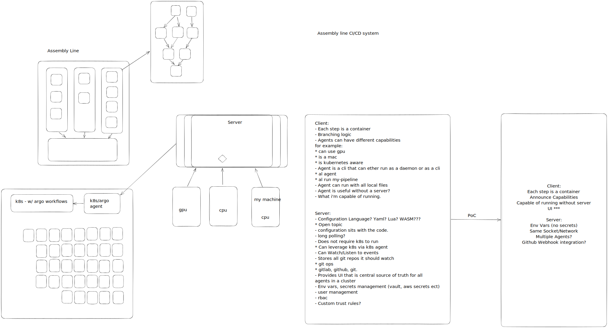

# Assembly Line
Assembly line is a pipelining monster. Have you ever wanted to run the same pipeline to build your project, test your project or you know, lint it locally the same way your build server can?

Well now you can. or you know... will be able to.

This project is young and raw. Join in if you would like to help!

Here is a high level view of what we are thinking:

Office hours will be held every second the third tuesday of a month, calandar link to follow in a little bit.

Join the discord and stark talking all things assembly line with us!
[discord](https://discord.gg/SaJFQ8V)

[meeting notes](https://docs.google.com/document/d/1Tx57fBuWZfVuG4Qu5IBoVEy7O17-7fRpiPF1Yph8i9w/edit?usp=sharing)

Thanks!
