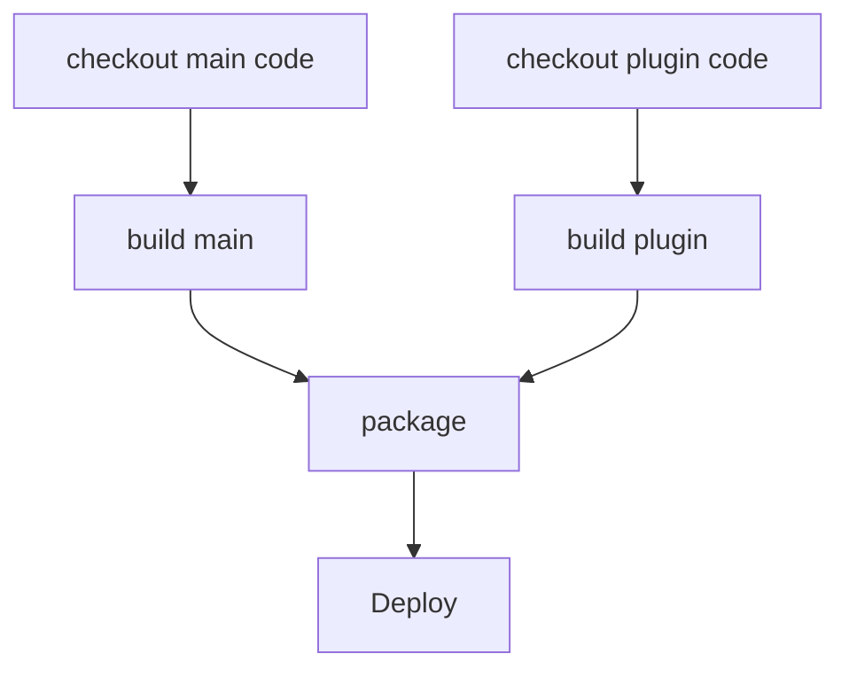
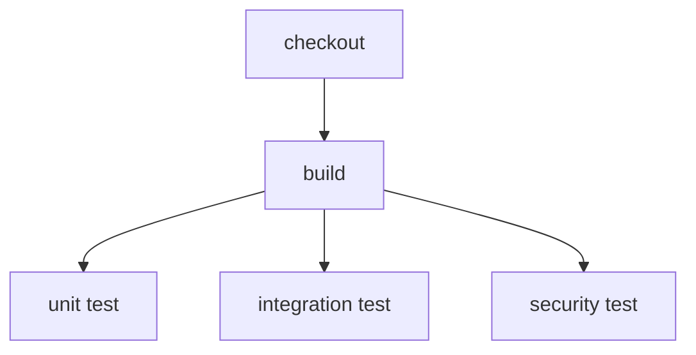
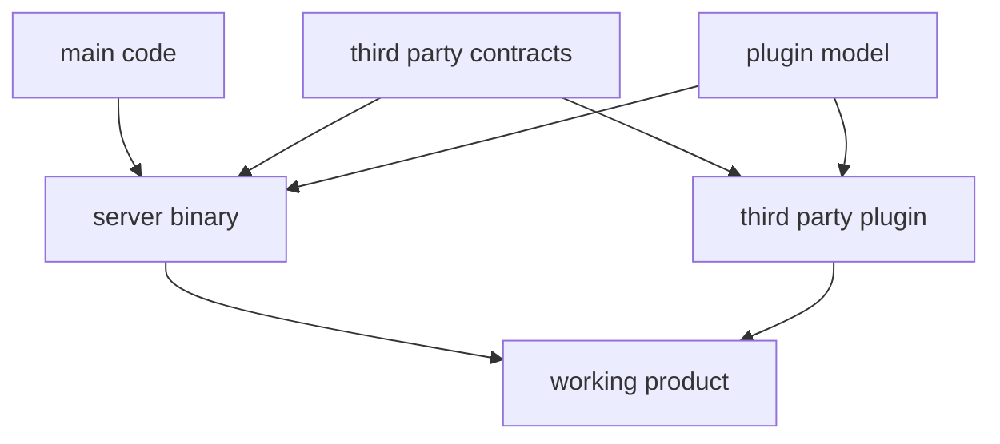

# How do we define parallel steps in yaml?

Do we want to support all of these?
- many to one
- one to many 
- many to many

## many to one



> The following is a guess at how to model it in YAML (grossly simplified view for graph representation modelling)

```yaml
name: many_to_one
actions:
  - step:
    name: checkout_main_code
  - step:
    name: build_main
    dependencies:
      - step: checkout_main_code
  - step:
    name: checkout_plugin_code
  - step:
    name: build_plugin
    dependencies:
      - step: checkout_plugin_code
  - step:
    name: package
    dependencies:
      - step: build_main
      - step: build_plugin
  - step:
    name: deploy
    dependencies:
      - step: deploy
```

how would we model and/or?

## one to many



```yaml
name: one_to_many
actions:
  - step:
    name: checkout
  - step:
    name: build
    dependencies:
      - step: checkout
  - step:
    name: unit_test
    dependencies:
      - step: build
  - step:
    name: integration_test
    dependencies:
      - step: build
  - step:
    name: security_test
    dependencies:
      - step: build
```

how would we indicate some/all of the multiple states need to pass to be a successful run? Could you have an optional marker so at least one final state of optional needs to pass to be a success? What about an, albeit cursed scenario, where unit and integration test passes means success, and you can ignore security. I guess the question is and/or logic again really...

## many to many


```yaml
name: many_to_many
actions:
  - step:
    name: main_code
  - step:
    name: third_party_contracts
  - step:
    name: plugin_model
  - step:
    name: server_binary
    dependencies:
      - step: main_code
      - step: third_party_contracts
      - step: plugin_model
  - step:
    name: third_party_plugin
    dependencies:
      - step: third_party_contracts
      - step: plugin_model
  - step:
    name: working_product
    dependencies:
      - step: server_binary
      - step: third_party_plugin
```

Is there a world where a step could be a dynamic graph of sub steps? I guess this would be the pipelines calling pipelines. Does that mean a step could also be a pipeline - would we have special syntax for that or is it just another containers that knows how to call assembly line to run another pipeline?
